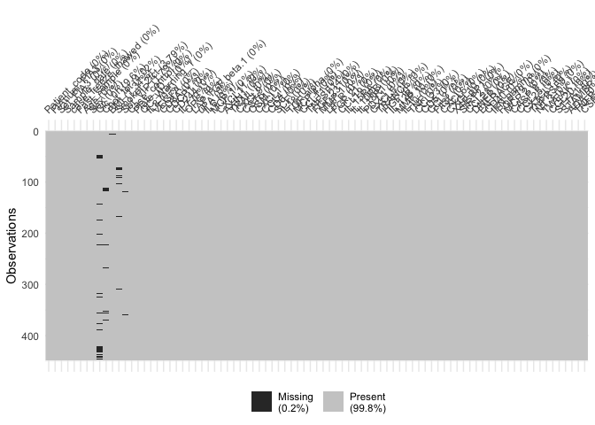
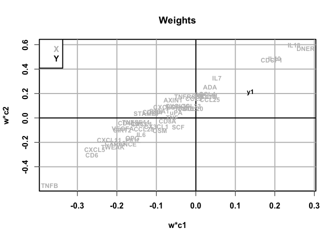

QC document
================
Fredrik Landfors
12/2/2020

  - [QC: Proximity extension assay](#qc-proximity-extension-assay)
      - [Olink ORGAN DAMAGE (v.3311)](#olink-organ-damage-v.3311)
          - [A. Missing values](#a.-missing-values)
          - [B. Lower limit of detection
            (LOD)](#b.-lower-limit-of-detection-lod)
          - [C. Batch effects](#c.-batch-effects)
          - [D. Preanalytic effects](#d.-preanalytic-effects)
          - [E. Olink QC flag](#e.-olink-qc-flag)
          - [F. Plate randomization](#f.-plate-randomization)
      - [Olink INFLAMMATION (v.3021)](#olink-inflammation-v.3021)
          - [A. Missing values](#a.-missing-values-1)
          - [B. Lower limit of detection
            (LOD)](#b.-lower-limit-of-detection-lod-1)
          - [C. Batch effects](#c.-batch-effects-1)
          - [D. Preanalytic effects](#d.-preanalytic-effects-1)
          - [E. Olink QC flag](#e.-olink-qc-flag-1)
          - [F. Plate randomization](#f.-plate-randomization-1)

Source libraries and functions:

``` r
source("./src/check_packages.R")
check_packages(
  cran_packages = c("ggplot2", "naniar", "UpSetR"),
  bioc_packages = c("ropls")
)
```

    ## [1] "Passed dependency check."

``` r
library(ggplot2)
source("./src/plot_pca.R")
source("./src/geom_cwise_boxplot.R")
source("./src/geom_rwise_boxplot.R")
```

Load data:

``` r
load("~/projekt_data/2019-11-19_SCD-FIA3_data/rData/markdown.RData")
```

# QC: Proximity extension assay

Get data:

``` r
qc <- list()
preanalytic_factors <- c(
  "Patient_code",
  "FIAnum_FIA3",
  "Set_FIA3",
  "Sample_date",
  "case_freeze_thawed",
  "Fast_sample",
  "Age", 
  "Sex"
)
randomization_factors <- c(
  "Glc_0h",
  "Chol_tot",
  "BMI",
  "Smoker_2fct",
  "Sbt_VIP",
  "Case_control"
)
qc$inf <- merge(
  x = preproc$raw_fia$data_out[c(preanalytic_factors, randomization_factors)],
  y = preproc$raw_inf$data_out,
  by = "Patient_code"
)
qc$org <- merge(
  x = preproc$raw_fia$data_out[c(preanalytic_factors, randomization_factors)],
  y = preproc$raw_org$data_out,
  by = "Patient_code"
)
qc$org_proteins <- names(preproc$raw_org$data_out)[
  names(preproc$raw_org$data_out) %in% preproc$raw_org$varmeta_data$name1
]
qc$inf_proteins <- names(preproc$raw_inf$data_out)[
  names(preproc$raw_inf$data_out) %in% preproc$raw_inf$varmeta_data$name1
]
```

## Olink ORGAN DAMAGE (v.3311)

### A. Missing values

``` r
naniar::vis_miss(qc$org)
```

<!-- -->

### B. Lower limit of detection (LOD)

Values with \> 5 % of values below LOD were excluded from further
analysis. This reduced the count of proteins by 39 from 92 to 53.

``` r
length(qc$org_proteins)
```

    ## [1] 53

``` r
length(preproc$raw_org$varmeta_data$name1)
```

    ## [1] 92

``` r
length(preproc$raw_org$varmeta_data$name1) - length(qc$org_proteins)
```

    ## [1] 39

### C. Batch effects

PCA colored for plate ID

``` r
plot_pca(
      x = qc$org[, qc$org_proteins],
      c = qc$org["Plate_ID_2"],
      opt_ellipse = "auto",
      return_fit = FALSE,
      n_pc = 7
)
```

    ## $pc1vs2_plot

<!-- -->

    ## 
    ## $scores_plot

<!-- -->

    ## 
    ## $var_expl

<!-- -->

    ## 
    ## $loadings_plot

<!-- -->

PLS model

``` r
# ropls::opls(
#   x = qc$org[, qc$org_proteins],
#   y = qc$org[, "Plate_ID_2"]
# )
```

PLS model: force two predictive components because first model did not
pass permutation test

``` r
ropls::opls(
  x = qc$org[, qc$org_proteins],
  y = qc$org[, "Plate_ID_2"],
  predI = 2
)
```

    ## PLS-DA
    ## 448 samples x 53 variables and 1 response
    ## standard scaling of predictors and response(s)
    ##       R2X(cum) R2Y(cum) Q2(cum) RMSEE pre ort pR2Y  pQ2
    ## Total    0.326   0.0197 -0.0147 0.397   2   0  0.7 0.35

<!-- -->

### D. Preanalytic effects

#### Freeze-thaw cycles

``` r
plot_pca(
      x = qc$org[, qc$org_proteins],
      c = qc$org["case_freeze_thawed"],
      opt_ellipse = "auto",
      return_fit = FALSE,
      n_pc = 7
)
```

    ## $pc1vs2_plot

<!-- -->

    ## 
    ## $scores_plot

<!-- -->

    ## 
    ## $var_expl

<!-- -->

    ## 
    ## $loadings_plot

<!-- -->

``` r
pls1 <- ropls::opls(
  x = qc$org[, qc$org_proteins],
  y = qc$org[, "case_freeze_thawed"]
)
```

    ## PLS-DA
    ## 448 samples x 53 variables and 1 response
    ## standard scaling of predictors and response(s)
    ##       R2X(cum) R2Y(cum) Q2(cum) RMSEE pre ort pR2Y  pQ2
    ## Total    0.325    0.158   0.121 0.265   2   0 0.05 0.05

<!-- -->

``` r
ropls::plot(pls1, typeVc = "xy-weight")
```

<!-- -->

#### Fasting

``` r
plot_pca(
      x = qc$org[, qc$org_proteins],
      c = qc$org["Fast_sample"],
      opt_ellipse = "auto",
      return_fit = FALSE,
      n_pc = 7
)
```

    ## $pc1vs2_plot

<!-- -->

    ## 
    ## $scores_plot

<!-- -->

    ## 
    ## $var_expl

<!-- -->

    ## 
    ## $loadings_plot

<!-- -->

``` r
pls2 <- ropls::opls(
  x = qc$org[, qc$org_proteins],
  y = qc$org[, "Fast_sample"],
  predI = 2
)
```

    ## PLS-DA
    ## 448 samples x 53 variables and 1 response
    ## standard scaling of predictors and response(s)
    ##       R2X(cum) R2Y(cum) Q2(cum) RMSEE pre ort pR2Y pQ2
    ## Total    0.303   0.0648 -0.0282 0.311   2   0 0.05 0.8

<!-- -->

#### Sample date

``` r
plot_pca(
      x = qc$org[, qc$org_proteins],
      c = qc$org["Sample_date"],
      opt_ellipse = "auto",
      return_fit = FALSE,
      n_pc = 7
)
```

    ## $pc1vs2_plot

<!-- -->

    ## 
    ## $scores_plot

<!-- -->

    ## 
    ## $var_expl

<!-- -->

    ## 
    ## $loadings_plot

<!-- -->

``` r
pls3 <- ropls::opls(
  x = qc$org[, qc$org_proteins],
  y = sapply(
    qc$org[, "Sample_date"] ,
      function(x) {
        round(((as.numeric(x) - 6159) / 365.25 + 1986.86242), 0)
      }
    )
)
```

    ## PLS
    ## 448 samples x 53 variables and 1 response
    ## standard scaling of predictors and response(s)
    ##       R2X(cum) R2Y(cum) Q2(cum) RMSEE pre ort pR2Y  pQ2
    ## Total    0.321    0.146  0.0664  3.44   2   0 0.05 0.05

<!-- -->

``` r
ropls::plot(pls3, typeVc = "xy-weight")
```

<!-- -->

#### Age at sampling

``` r
plot_pca(
      x = qc$org[, qc$org_proteins],
      c = qc$org["Age"],
      opt_ellipse = "auto",
      return_fit = FALSE,
      n_pc = 7
)
```

    ## $pc1vs2_plot

<!-- -->

    ## 
    ## $scores_plot

<!-- -->

    ## 
    ## $var_expl

<!-- -->

    ## 
    ## $loadings_plot

<!-- -->

``` r
pls4 <- ropls::opls(
  x = qc$org[, qc$org_proteins],
  y = qc$org[, "Age"]
)
```

    ## PLS
    ## 448 samples x 53 variables and 1 response
    ## standard scaling of predictors and response(s)
    ##       R2X(cum) R2Y(cum) Q2(cum) RMSEE pre ort pR2Y  pQ2
    ## Total    0.389    0.286   0.172  5.93   3   0 0.05 0.05

<!-- -->

``` r
ropls::plot(pls4, typeVc = "xy-weight")
```

<!-- -->

#### Sex

``` r
plot_pca(
      x = qc$org[, qc$org_proteins],
      c = qc$org["Sex"],
      opt_ellipse = "auto",
      return_fit = FALSE,
      n_pc = 7
)
```

    ## $pc1vs2_plot

<!-- -->

    ## 
    ## $scores_plot

<!-- -->

    ## 
    ## $var_expl

<!-- -->

    ## 
    ## $loadings_plot

<!-- -->

``` r
pls4 <- ropls::opls(
  x = qc$org[, qc$org_proteins],
  y = qc$org[, "Sex"]
)
```

    ## PLS-DA
    ## 448 samples x 53 variables and 1 response
    ## standard scaling of predictors and response(s)
    ##       R2X(cum) R2Y(cum) Q2(cum) RMSEE pre ort pR2Y  pQ2
    ## Total    0.383    0.478   0.361 0.293   3   0 0.05 0.05

<!-- -->

``` r
ropls::plot(pls4, typeVc = "xy-weight")
```

<!-- -->

### E. Olink QC flag

Looking at QC-flagged samples in plates 1-5 (coloured blue):

``` r
geom_rwise_boxplot(
      x = subset(qc$org, Plate_ID_2 == "FIA3_2-ORG-1", select = qc$org_proteins),
      fill1 = qc$org$QC_Warning_2
)
```

<!-- -->

``` r
geom_rwise_boxplot(
      x = subset(qc$org, Plate_ID_2 == "FIA3_2-ORG-2", select = qc$org_proteins),
      fill1 = qc$org$QC_Warning_2
)
```

<!-- -->

``` r
geom_rwise_boxplot(
      x = subset(qc$org, Plate_ID_2 == "FIA3_2-ORG-3", select = qc$org_proteins),
      fill1 = qc$org$QC_Warning_2
)
```

<!-- -->

``` r
geom_rwise_boxplot(
      x = subset(qc$org, Plate_ID_2 == "FIA3_2-ORG-4", select = qc$org_proteins),
      fill1 = qc$org$QC_Warning_2
)
```

<!-- -->

``` r
geom_rwise_boxplot(
      x = subset(qc$org, Plate_ID_2 == "FIA3_2-ORG-5", select = qc$org_proteins),
      fill1 = qc$org$QC_Warning_2
)
```

<!-- -->

### F. Plate randomization

Checks if case/ctrl pairs were analyzed on the same plates

``` r
table(table(subset(qc$org, Plate_ID_2 == "FIA3_2-ORG-1", select = "Set_FIA3")) == 2)
```

    ## 
    ## TRUE 
    ##   45

``` r
table(table(subset(qc$org, Plate_ID_2 == "FIA3_2-ORG-2", select = "Set_FIA3")) == 2)
```

    ## 
    ## TRUE 
    ##   45

``` r
table(table(subset(qc$org, Plate_ID_2 == "FIA3_2-ORG-3", select = "Set_FIA3")) == 2)
```

    ## 
    ## TRUE 
    ##   45

``` r
table(table(subset(qc$org, Plate_ID_2 == "FIA3_2-ORG-4", select = "Set_FIA3")) == 2)
```

    ## 
    ## TRUE 
    ##   45

``` r
table(table(subset(qc$org, Plate_ID_2 == "FIA3_2-ORG-5", select = "Set_FIA3")) == 2)
```

    ## 
    ## TRUE 
    ##   44

Check covariate randomization across plates

``` r
# BMI
anova(lm(formula = BMI ~ Plate_ID_2, data = qc$org))
```

    ## Analysis of Variance Table
    ## 
    ## Response: BMI
    ##             Df Sum Sq Mean Sq F value Pr(>F)
    ## Plate_ID_2   4   30.0  7.5077  0.4049 0.8051
    ## Residuals  437 8102.4 18.5411

``` r
# Total cholesterol
anova(lm(formula = Chol_tot ~ Plate_ID_2, data = qc$org))
```

    ## Analysis of Variance Table
    ## 
    ## Response: Chol_tot
    ##             Df Sum Sq Mean Sq F value  Pr(>F)  
    ## Plate_ID_2   4  13.83  3.4587   2.272 0.06077 .
    ## Residuals  425 646.98  1.5223                  
    ## ---
    ## Signif. codes:  0 '***' 0.001 '**' 0.01 '*' 0.05 '.' 0.1 ' ' 1

``` r
# Systolic blood pressure
anova(lm(formula = Sbt_VIP ~ Plate_ID_2, data = qc$org))
```

    ## Analysis of Variance Table
    ## 
    ## Response: Sbt_VIP
    ##             Df Sum Sq Mean Sq F value   Pr(>F)   
    ## Plate_ID_2   4   6529 1632.37  4.3887 0.001729 **
    ## Residuals  435 161797  371.95                    
    ## ---
    ## Signif. codes:  0 '***' 0.001 '**' 0.01 '*' 0.05 '.' 0.1 ' ' 1

``` r
summary(lm(formula = Sbt_VIP ~ Plate_ID_2, data = qc$org))
```

    ## 
    ## Call:
    ## lm(formula = Sbt_VIP ~ Plate_ID_2, data = qc$org)
    ## 
    ## Residuals:
    ##     Min      1Q  Median      3Q     Max 
    ## -41.552 -13.753  -2.045  11.955  54.986 
    ## 
    ## Coefficients:
    ##                        Estimate Std. Error t value Pr(>|t|)    
    ## (Intercept)            138.7528     2.0443  67.873   <2e-16 ***
    ## Plate_ID_2FIA3_2-ORG-2   4.7989     2.9077   1.650   0.0996 .  
    ## Plate_ID_2FIA3_2-ORG-3  -0.7303     2.8911  -0.253   0.8007    
    ## Plate_ID_2FIA3_2-ORG-4  -6.7079     2.8911  -2.320   0.0208 *  
    ## Plate_ID_2FIA3_2-ORG-5  -3.7384     2.9162  -1.282   0.2005    
    ## ---
    ## Signif. codes:  0 '***' 0.001 '**' 0.01 '*' 0.05 '.' 0.1 ' ' 1
    ## 
    ## Residual standard error: 19.29 on 435 degrees of freedom
    ##   (8 observations deleted due to missingness)
    ## Multiple R-squared:  0.03879,    Adjusted R-squared:  0.02995 
    ## F-statistic: 4.389 on 4 and 435 DF,  p-value: 0.001729

``` r
# Glucose
anova(lm(formula = Glc_0h ~ Plate_ID_2, data = qc$org))
```

    ## Analysis of Variance Table
    ## 
    ## Response: Glc_0h
    ##             Df  Sum Sq Mean Sq F value Pr(>F)
    ## Plate_ID_2   4   24.69  6.1726   1.456 0.2149
    ## Residuals  400 1695.75  4.2394

``` r
# Smoking status
table(qc$org[c("Smoker_2fct", "Plate_ID_2")])
```

    ##            Plate_ID_2
    ## Smoker_2fct FIA3_2-ORG-1 FIA3_2-ORG-2 FIA3_2-ORG-3 FIA3_2-ORG-4 FIA3_2-ORG-5
    ##         no            58           63           65           55           58
    ##         yes           24           22           24           33           29

``` r
chisq.test(table(qc$org[c("Smoker_2fct", "Plate_ID_2")]))
```

    ## 
    ##  Pearson's Chi-squared test
    ## 
    ## data:  table(qc$org[c("Smoker_2fct", "Plate_ID_2")])
    ## X-squared = 3.7896, df = 4, p-value = 0.4352

Check pre-analytic factor randomization across plates

``` r
# Sample date
anova(lm(formula = as.numeric(Sample_date) ~ Plate_ID_2, data = qc$org))
```

    ## Analysis of Variance Table
    ## 
    ## Response: as.numeric(Sample_date)
    ##             Df    Sum Sq  Mean Sq F value    Pr(>F)    
    ## Plate_ID_2   4  88654663 22163666  13.415 2.499e-10 ***
    ## Residuals  443 731879195  1652098                      
    ## ---
    ## Signif. codes:  0 '***' 0.001 '**' 0.01 '*' 0.05 '.' 0.1 ' ' 1

``` r
summary(lm(formula = as.numeric(Sample_date) ~ Plate_ID_2, data = qc$org))
```

    ## 
    ## Call:
    ## lm(formula = as.numeric(Sample_date) ~ Plate_ID_2, data = qc$org)
    ## 
    ## Residuals:
    ##     Min      1Q  Median      3Q     Max 
    ## -3313.2  -716.7    20.5   734.2  4828.2 
    ## 
    ## Coefficients:
    ##                        Estimate Std. Error t value Pr(>|t|)    
    ## (Intercept)              8296.8      135.5  61.237  < 2e-16 ***
    ## Plate_ID_2FIA3_2-ORG-2    705.2      191.6   3.680 0.000262 ***
    ## Plate_ID_2FIA3_2-ORG-3   1237.5      191.6   6.459 2.78e-10 ***
    ## Plate_ID_2FIA3_2-ORG-4   1175.5      191.6   6.135 1.89e-09 ***
    ## Plate_ID_2FIA3_2-ORG-5    861.8      192.7   4.473 9.83e-06 ***
    ## ---
    ## Signif. codes:  0 '***' 0.001 '**' 0.01 '*' 0.05 '.' 0.1 ' ' 1
    ## 
    ## Residual standard error: 1285 on 443 degrees of freedom
    ## Multiple R-squared:  0.108,  Adjusted R-squared:  0.09999 
    ## F-statistic: 13.42 on 4 and 443 DF,  p-value: 2.499e-10

``` r
# Fasting
table(qc$org[c("Fast_sample", "Plate_ID_2")])
```

    ##            Plate_ID_2
    ## Fast_sample FIA3_2-ORG-1 FIA3_2-ORG-2 FIA3_2-ORG-3 FIA3_2-ORG-4 FIA3_2-ORG-5
    ##        0-4h            5            8            3            6            2
    ##        4-6h           26            6           15            8           27
    ##        6-8h            1            2            3            0            2
    ##        >8h            58           74           69           76           57

``` r
chisq.test(table(qc$org[c("Fast_sample", "Plate_ID_2")]))
```

    ## Warning in chisq.test(table(qc$org[c("Fast_sample", "Plate_ID_2")])): Chi-
    ## squared approximation may be incorrect

    ## 
    ##  Pearson's Chi-squared test
    ## 
    ## data:  table(qc$org[c("Fast_sample", "Plate_ID_2")])
    ## X-squared = 36.23, df = 12, p-value = 0.0002975

``` r
table(table(subset(qc$org, Fast_sample == "0-4h", select = "Set_FIA3")) == 2)
```

    ## 
    ## FALSE  TRUE 
    ##    16     4

``` r
table(table(subset(qc$org, Fast_sample == "4-6h", select = "Set_FIA3")) == 2)
```

    ## 
    ## FALSE  TRUE 
    ##    32    25

``` r
table(table(subset(qc$org, Fast_sample == "6-8h", select = "Set_FIA3")) == 2)
```

    ## 
    ## FALSE 
    ##     8

``` r
table(table(subset(qc$org, Fast_sample == ">8h", select = "Set_FIA3")) == 2)
```

    ## 
    ## FALSE  TRUE 
    ##    46   144

``` r
# Freeze/thaw status
table(qc$org[c("case_freeze_thawed", "Plate_ID_2")])
```

    ##                                              Plate_ID_2
    ## case_freeze_thawed                            FIA3_2-ORG-1 FIA3_2-ORG-2
    ##   NO                                                    62           58
    ##   ONCE                                                  18           20
    ##   Thawed due to broken freezer but still cold            6            8
    ##   TWICE                                                  4            4
    ##                                              Plate_ID_2
    ## case_freeze_thawed                            FIA3_2-ORG-3 FIA3_2-ORG-4
    ##   NO                                                    74           78
    ##   ONCE                                                  12            4
    ##   Thawed due to broken freezer but still cold            4            8
    ##   TWICE                                                  0            0
    ##                                              Plate_ID_2
    ## case_freeze_thawed                            FIA3_2-ORG-5
    ##   NO                                                    82
    ##   ONCE                                                   2
    ##   Thawed due to broken freezer but still cold            4
    ##   TWICE                                                  0

``` r
chisq.test(table(qc$org[c("case_freeze_thawed", "Plate_ID_2")]))
```

    ## Warning in chisq.test(table(qc$org[c("case_freeze_thawed", "Plate_ID_2")])):
    ## Chi-squared approximation may be incorrect

    ## 
    ##  Pearson's Chi-squared test
    ## 
    ## data:  table(qc$org[c("case_freeze_thawed", "Plate_ID_2")])
    ## X-squared = 44.039, df = 12, p-value = 1.504e-05

``` r
table(table(subset(qc$org, case_freeze_thawed == "NO", select = "Set_FIA3")) == 2)
```

    ## 
    ## TRUE 
    ##  177

``` r
table(table(subset(qc$org, case_freeze_thawed == "ONCE", select = "Set_FIA3")) == 2)
```

    ## 
    ## TRUE 
    ##   28

``` r
table(table(subset(qc$org, case_freeze_thawed == "Thawed due to broken freezer but still cold", select = "Set_FIA3")) == 2)
```

    ## 
    ## TRUE 
    ##   15

``` r
table(table(subset(qc$org, case_freeze_thawed == "TWICE", select = "Set_FIA3")) == 2)
```

    ## 
    ## TRUE 
    ##    4

Case control matching was perfect for freeze/thaw cycles, but not for
fasting time.

Check fasting time overlap using a UpSet plot.

``` r
qc_split <- split(
  qc$org[c(preanalytic_factors, randomization_factors)],
  f = qc$org$Case_control
)
qc_overlap <- merge(
  x = qc_split$Ctrl[c("Set_FIA3", "Fast_sample")],
  y = qc_split$Case[c("Set_FIA3", "Fast_sample")],
  by = "Set_FIA3"
)
names(qc_overlap) <- c("Set_FIA3", "ctrl_", "case_")
qc_overlap2 <- data.frame(
  qc_overlap["Set_FIA3"],
  model.matrix(~ ctrl_ - 1, data = qc_overlap["ctrl_"]),
  model.matrix(~ case_ - 1, data = qc_overlap["case_"])
)
UpSetR::upset(
  qc_overlap2,
  #nsets = 8, 
  sets = c("ctrl_0.4h",
           "case_0.4h",
           "ctrl_4.6h",
           "case_4.6h",
           "ctrl_6.8h",
           "case_6.8h",
           "ctrl_.8h",
           "case_.8h"),
  keep.order = TRUE
)
```

<!-- -->
Conclusion: 12 pairs where fasted subjects were matched with recently
fed subjects.

## Olink INFLAMMATION (v.3021)

### A. Missing values

``` r
naniar::vis_miss(qc$inf)
```

<!-- -->

### B. Lower limit of detection (LOD)

Values with \> 5 % of values below LOD were excluded from further
analysis. This reduced the count of proteins by 45 from 92 to 47.

``` r
length(qc$inf_proteins)
```

    ## [1] 47

``` r
length(preproc$raw_inf$varmeta_data$name1)
```

    ## [1] 92

``` r
length(preproc$raw_inf$varmeta_data$name1) - length(qc$inf_proteins)
```

    ## [1] 45

### C. Batch effects

PCA colored for plate ID

``` r
plot_pca(
      x = qc$inf[, qc$inf_proteins],
      c = qc$inf["Plate_ID_1"],
      opt_ellipse = "auto",
      return_fit = FALSE,
      n_pc = 7
)
```

    ## $pc1vs2_plot

<!-- -->

    ## 
    ## $scores_plot

<!-- -->

    ## 
    ## $var_expl

<!-- -->

    ## 
    ## $loadings_plot

<!-- -->

PLS model

``` r
# ropls::opls(
#   x = qc$inf[, qc$inf_proteins],
#   y = qc$inf[, "Plate_ID_1"]
# )
```

PLS model: force two predictive components

``` r
ropls::opls(
  x = qc$inf[, qc$inf_proteins],
  y = qc$inf[, "Plate_ID_1"],
  predI = 2
)
```

    ## PLS-DA
    ## 448 samples x 47 variables and 1 response
    ## standard scaling of predictors and response(s)
    ##       R2X(cum) R2Y(cum) Q2(cum) RMSEE pre ort pR2Y pQ2
    ## Total    0.236   0.0231 -0.0475 0.397   2   0  0.6   1

<!-- -->

### D. Preanalytic effects

#### Freeze-thaw cycles

``` r
plot_pca(
      x = qc$inf[, qc$inf_proteins],
      c = qc$inf["case_freeze_thawed"],
      opt_ellipse = "auto",
      return_fit = FALSE,
      n_pc = 7
)
```

    ## $pc1vs2_plot

<!-- -->

    ## 
    ## $scores_plot

<!-- -->

    ## 
    ## $var_expl

<!-- -->

    ## 
    ## $loadings_plot

<!-- -->

``` r
pls1 <- ropls::opls(
  x = qc$inf[, qc$inf_proteins],
  y = qc$inf[, "case_freeze_thawed"]
)
```

    ## PLS-DA
    ## 448 samples x 47 variables and 1 response
    ## standard scaling of predictors and response(s)
    ##       R2X(cum) R2Y(cum) Q2(cum) RMSEE pre ort pR2Y  pQ2
    ## Total    0.277   0.0838  0.0168 0.282   2   0 0.05 0.05

<!-- -->

``` r
ropls::plot(pls1, typeVc = "xy-weight")
```

<!-- -->

#### Fasting

``` r
plot_pca(
      x = qc$inf[, qc$inf_proteins],
      c = qc$inf["Fast_sample"],
      opt_ellipse = "auto",
      return_fit = FALSE,
      n_pc = 7
)
```

    ## $pc1vs2_plot

<!-- -->

    ## 
    ## $scores_plot

<!-- -->

    ## 
    ## $var_expl

<!-- -->

    ## 
    ## $loadings_plot

<!-- -->

``` r
pls2 <- ropls::opls(
  x = qc$inf[, qc$inf_proteins],
  y = qc$inf[, "Fast_sample"],
  predI = 2
)
```

    ## PLS-DA
    ## 448 samples x 47 variables and 1 response
    ## standard scaling of predictors and response(s)
    ##       R2X(cum) R2Y(cum) Q2(cum) RMSEE pre ort pR2Y pQ2
    ## Total    0.202   0.0499 -0.0505 0.309   2   0 0.05 0.9

<!-- -->

#### Sample date

``` r
plot_pca(
      x = qc$inf[, qc$inf_proteins],
      c = qc$inf["Sample_date"],
      opt_ellipse = "auto",
      return_fit = FALSE,
      n_pc = 7
)
```

    ## $pc1vs2_plot

<!-- -->

    ## 
    ## $scores_plot

<!-- -->

    ## 
    ## $var_expl

<!-- -->

    ## 
    ## $loadings_plot

<!-- -->

``` r
pls3 <- ropls::opls(
  x = qc$inf[, qc$inf_proteins],
  y = sapply(
    qc$inf[, "Sample_date"] ,
      function(x) {
        round(((as.numeric(x) - 6159) / 365.25 + 1986.86242), 0)
      }
    )
)
```

    ## PLS
    ## 448 samples x 47 variables and 1 response
    ## standard scaling of predictors and response(s)
    ##       R2X(cum) R2Y(cum) Q2(cum) RMSEE pre ort pR2Y  pQ2
    ## Total    0.204   0.0467  0.0184  3.63   1   0  0.4 0.05

    ## Warning: Single component model: only 'overview' and 'permutation' (in case of
    ## single response (O)PLS(-DA)) plots available

``` r
ropls::plot(pls3, typeVc = "xy-weight")
```

    ## Warning: Single component model: only 'overview' and 'permutation' (in case of
    ## single response (O)PLS(-DA)) plots available

<!-- -->

#### Age at sampling

``` r
plot_pca(
      x = qc$inf[, qc$inf_proteins],
      c = qc$inf["Age"],
      opt_ellipse = "auto",
      return_fit = FALSE,
      n_pc = 7
)
```

    ## $pc1vs2_plot

<!-- -->

    ## 
    ## $scores_plot

<!-- -->

    ## 
    ## $var_expl

<!-- -->

    ## 
    ## $loadings_plot

<!-- -->

``` r
pls4 <- ropls::opls(
  x = qc$inf[, qc$inf_proteins],
  y = qc$inf[, "Age"]
)
```

    ## PLS
    ## 448 samples x 47 variables and 1 response
    ## standard scaling of predictors and response(s)
    ##       R2X(cum) R2Y(cum) Q2(cum) RMSEE pre ort pR2Y  pQ2
    ## Total    0.303    0.191   0.125  6.31   2   0 0.05 0.05

<!-- -->

``` r
ropls::plot(pls4, typeVc = "xy-weight")
```

<!-- -->

#### Sex

``` r
plot_pca(
      x = qc$inf[, qc$inf_proteins],
      c = qc$inf["Sex"],
      opt_ellipse = "auto",
      return_fit = FALSE,
      n_pc = 7
)
```

    ## $pc1vs2_plot

<!-- -->

    ## 
    ## $scores_plot

<!-- -->

    ## 
    ## $var_expl

<!-- -->

    ## 
    ## $loadings_plot

<!-- -->

``` r
pls4 <- ropls::opls(
  x = qc$inf[, qc$inf_proteins],
  y = qc$inf[, "Sex"]
)
```

    ## PLS-DA
    ## 448 samples x 47 variables and 1 response
    ## standard scaling of predictors and response(s)
    ##       R2X(cum) R2Y(cum) Q2(cum) RMSEE pre ort pR2Y  pQ2
    ## Total    0.265    0.202   0.101 0.362   2   0 0.05 0.05

<!-- -->

``` r
ropls::plot(pls4, typeVc = "xy-weight")
```

<!-- -->

### E. Olink QC flag

Looking at QC-flagged samples in plates 1-5 (coloured blue):

``` r
geom_rwise_boxplot(
      x = subset(qc$inf, Plate_ID_1 == "FIA3_2-INF-1", select = qc$inf_proteins),
      fill1 = qc$inf$QC_Warning_1
)
```

<!-- -->

``` r
geom_rwise_boxplot(
      x = subset(qc$inf, Plate_ID_1 == "FIA3_2-INF-2", select = qc$inf_proteins),
      fill1 = qc$inf$QC_Warning_1
)
```

<!-- -->

``` r
geom_rwise_boxplot(
      x = subset(qc$inf, Plate_ID_1 == "FIA3_2-INF-3", select = qc$inf_proteins),
      fill1 = qc$inf$QC_Warning_1
)
```

<!-- -->

``` r
geom_rwise_boxplot(
      x = subset(qc$inf, Plate_ID_1 == "FIA3_2-INF-4", select = qc$inf_proteins),
      fill1 = qc$inf$QC_Warning_1
)
```

<!-- -->

``` r
geom_rwise_boxplot(
      x = subset(qc$inf, Plate_ID_1 == "FIA3_2-INF5", select = qc$inf_proteins),
      fill1 = qc$inf$QC_Warning_1
)
```

<!-- -->

### F. Plate randomization

Checks if case/ctrl pairs were analyzed on the same plates

``` r
table(table(subset(qc$inf, Plate_ID_1 == "FIA3_2-INF-1", select = "Set_FIA3")) == 2)
```

    ## 
    ## TRUE 
    ##   45

``` r
table(table(subset(qc$inf, Plate_ID_1 == "FIA3_2-INF-2", select = "Set_FIA3")) == 2)
```

    ## 
    ## TRUE 
    ##   45

``` r
table(table(subset(qc$inf, Plate_ID_1 == "FIA3_2-INF-3", select = "Set_FIA3")) == 2)
```

    ## 
    ## TRUE 
    ##   45

``` r
table(table(subset(qc$inf, Plate_ID_1 == "FIA3_2-INF-4", select = "Set_FIA3")) == 2)
```

    ## 
    ## TRUE 
    ##   45

``` r
table(table(subset(qc$inf, Plate_ID_1 == "FIA3_2-INF5", select = "Set_FIA3")) == 2)
```

    ## 
    ## TRUE 
    ##   44

Check covariate randomization across plates

``` r
# BMI
anova(lm(formula = BMI ~ Plate_ID_1, data = qc$inf))
```

    ## Analysis of Variance Table
    ## 
    ## Response: BMI
    ##             Df Sum Sq Mean Sq F value Pr(>F)
    ## Plate_ID_1   4   30.0  7.5077  0.4049 0.8051
    ## Residuals  437 8102.4 18.5411

``` r
# Total cholesterol
anova(lm(formula = Chol_tot ~ Plate_ID_1, data = qc$inf))
```

    ## Analysis of Variance Table
    ## 
    ## Response: Chol_tot
    ##             Df Sum Sq Mean Sq F value  Pr(>F)  
    ## Plate_ID_1   4  13.83  3.4587   2.272 0.06077 .
    ## Residuals  425 646.98  1.5223                  
    ## ---
    ## Signif. codes:  0 '***' 0.001 '**' 0.01 '*' 0.05 '.' 0.1 ' ' 1

``` r
# Systolic blood pressure
anova(lm(formula = Sbt_VIP ~ Plate_ID_1, data = qc$inf))
```

    ## Analysis of Variance Table
    ## 
    ## Response: Sbt_VIP
    ##             Df Sum Sq Mean Sq F value   Pr(>F)   
    ## Plate_ID_1   4   6529 1632.37  4.3887 0.001729 **
    ## Residuals  435 161797  371.95                    
    ## ---
    ## Signif. codes:  0 '***' 0.001 '**' 0.01 '*' 0.05 '.' 0.1 ' ' 1

``` r
summary(lm(formula = Sbt_VIP ~ Plate_ID_1, data = qc$inf))
```

    ## 
    ## Call:
    ## lm(formula = Sbt_VIP ~ Plate_ID_1, data = qc$inf)
    ## 
    ## Residuals:
    ##     Min      1Q  Median      3Q     Max 
    ## -41.552 -13.753  -2.045  11.955  54.986 
    ## 
    ## Coefficients:
    ##                        Estimate Std. Error t value Pr(>|t|)    
    ## (Intercept)            138.7528     2.0443  67.873   <2e-16 ***
    ## Plate_ID_1FIA3_2-INF-2   4.7989     2.9077   1.650   0.0996 .  
    ## Plate_ID_1FIA3_2-INF-3  -0.7303     2.8911  -0.253   0.8007    
    ## Plate_ID_1FIA3_2-INF-4  -6.7079     2.8911  -2.320   0.0208 *  
    ## Plate_ID_1FIA3_2-INF5   -3.7384     2.9162  -1.282   0.2005    
    ## ---
    ## Signif. codes:  0 '***' 0.001 '**' 0.01 '*' 0.05 '.' 0.1 ' ' 1
    ## 
    ## Residual standard error: 19.29 on 435 degrees of freedom
    ##   (8 observations deleted due to missingness)
    ## Multiple R-squared:  0.03879,    Adjusted R-squared:  0.02995 
    ## F-statistic: 4.389 on 4 and 435 DF,  p-value: 0.001729

``` r
# Glucose
anova(lm(formula = Glc_0h ~ Plate_ID_1, data = qc$inf))
```

    ## Analysis of Variance Table
    ## 
    ## Response: Glc_0h
    ##             Df  Sum Sq Mean Sq F value Pr(>F)
    ## Plate_ID_1   4   24.69  6.1726   1.456 0.2149
    ## Residuals  400 1695.75  4.2394

``` r
# Smoking status
table(qc$inf[c("Smoker_2fct", "Plate_ID_1")])
```

    ##            Plate_ID_1
    ## Smoker_2fct FIA3_2-INF-1 FIA3_2-INF-2 FIA3_2-INF-3 FIA3_2-INF-4 FIA3_2-INF5
    ##         no            58           63           65           55          58
    ##         yes           24           22           24           33          29

``` r
chisq.test(table(qc$inf[c("Smoker_2fct", "Plate_ID_1")]))
```

    ## 
    ##  Pearson's Chi-squared test
    ## 
    ## data:  table(qc$inf[c("Smoker_2fct", "Plate_ID_1")])
    ## X-squared = 3.7896, df = 4, p-value = 0.4352

Check pre-analytic factor randomization across plates

``` r
# Sample date
anova(lm(formula = as.numeric(Sample_date) ~ Plate_ID_1, data = qc$inf))
```

    ## Analysis of Variance Table
    ## 
    ## Response: as.numeric(Sample_date)
    ##             Df    Sum Sq  Mean Sq F value    Pr(>F)    
    ## Plate_ID_1   4  88654663 22163666  13.415 2.499e-10 ***
    ## Residuals  443 731879195  1652098                      
    ## ---
    ## Signif. codes:  0 '***' 0.001 '**' 0.01 '*' 0.05 '.' 0.1 ' ' 1

``` r
summary(lm(formula = as.numeric(Sample_date) ~ Plate_ID_1, data = qc$inf))
```

    ## 
    ## Call:
    ## lm(formula = as.numeric(Sample_date) ~ Plate_ID_1, data = qc$inf)
    ## 
    ## Residuals:
    ##     Min      1Q  Median      3Q     Max 
    ## -3313.2  -716.7    20.5   734.2  4828.2 
    ## 
    ## Coefficients:
    ##                        Estimate Std. Error t value Pr(>|t|)    
    ## (Intercept)              8296.8      135.5  61.237  < 2e-16 ***
    ## Plate_ID_1FIA3_2-INF-2    705.2      191.6   3.680 0.000262 ***
    ## Plate_ID_1FIA3_2-INF-3   1237.5      191.6   6.459 2.78e-10 ***
    ## Plate_ID_1FIA3_2-INF-4   1175.5      191.6   6.135 1.89e-09 ***
    ## Plate_ID_1FIA3_2-INF5     861.8      192.7   4.473 9.83e-06 ***
    ## ---
    ## Signif. codes:  0 '***' 0.001 '**' 0.01 '*' 0.05 '.' 0.1 ' ' 1
    ## 
    ## Residual standard error: 1285 on 443 degrees of freedom
    ## Multiple R-squared:  0.108,  Adjusted R-squared:  0.09999 
    ## F-statistic: 13.42 on 4 and 443 DF,  p-value: 2.499e-10

``` r
# Fasting
table(qc$inf[c("Fast_sample", "Plate_ID_1")])
```

    ##            Plate_ID_1
    ## Fast_sample FIA3_2-INF-1 FIA3_2-INF-2 FIA3_2-INF-3 FIA3_2-INF-4 FIA3_2-INF5
    ##        0-4h            5            8            3            6           2
    ##        4-6h           26            6           15            8          27
    ##        6-8h            1            2            3            0           2
    ##        >8h            58           74           69           76          57

``` r
chisq.test(table(qc$inf[c("Fast_sample", "Plate_ID_1")]))
```

    ## Warning in chisq.test(table(qc$inf[c("Fast_sample", "Plate_ID_1")])): Chi-
    ## squared approximation may be incorrect

    ## 
    ##  Pearson's Chi-squared test
    ## 
    ## data:  table(qc$inf[c("Fast_sample", "Plate_ID_1")])
    ## X-squared = 36.23, df = 12, p-value = 0.0002975

``` r
table(table(subset(qc$inf, Fast_sample == "0-4h", select = "Set_FIA3")) == 2)
```

    ## 
    ## FALSE  TRUE 
    ##    16     4

``` r
table(table(subset(qc$inf, Fast_sample == "4-6h", select = "Set_FIA3")) == 2)
```

    ## 
    ## FALSE  TRUE 
    ##    32    25

``` r
table(table(subset(qc$inf, Fast_sample == "6-8h", select = "Set_FIA3")) == 2)
```

    ## 
    ## FALSE 
    ##     8

``` r
table(table(subset(qc$inf, Fast_sample == ">8h", select = "Set_FIA3")) == 2)
```

    ## 
    ## FALSE  TRUE 
    ##    46   144

``` r
# Freeze/thaw status
table(qc$inf[c("case_freeze_thawed", "Plate_ID_1")])
```

    ##                                              Plate_ID_1
    ## case_freeze_thawed                            FIA3_2-INF-1 FIA3_2-INF-2
    ##   NO                                                    62           58
    ##   ONCE                                                  18           20
    ##   Thawed due to broken freezer but still cold            6            8
    ##   TWICE                                                  4            4
    ##                                              Plate_ID_1
    ## case_freeze_thawed                            FIA3_2-INF-3 FIA3_2-INF-4
    ##   NO                                                    74           78
    ##   ONCE                                                  12            4
    ##   Thawed due to broken freezer but still cold            4            8
    ##   TWICE                                                  0            0
    ##                                              Plate_ID_1
    ## case_freeze_thawed                            FIA3_2-INF5
    ##   NO                                                   82
    ##   ONCE                                                  2
    ##   Thawed due to broken freezer but still cold           4
    ##   TWICE                                                 0

``` r
chisq.test(table(qc$inf[c("case_freeze_thawed", "Plate_ID_1")]))
```

    ## Warning in chisq.test(table(qc$inf[c("case_freeze_thawed", "Plate_ID_1")])):
    ## Chi-squared approximation may be incorrect

    ## 
    ##  Pearson's Chi-squared test
    ## 
    ## data:  table(qc$inf[c("case_freeze_thawed", "Plate_ID_1")])
    ## X-squared = 44.039, df = 12, p-value = 1.504e-05

``` r
table(table(subset(qc$inf, case_freeze_thawed == "NO", select = "Set_FIA3")) == 2)
```

    ## 
    ## TRUE 
    ##  177

``` r
table(table(subset(qc$inf, case_freeze_thawed == "ONCE", select = "Set_FIA3")) == 2)
```

    ## 
    ## TRUE 
    ##   28

``` r
table(table(subset(qc$inf, case_freeze_thawed == "Thawed due to broken freezer but still cold", select = "Set_FIA3")) == 2)
```

    ## 
    ## TRUE 
    ##   15

``` r
table(table(subset(qc$inf, case_freeze_thawed == "TWICE", select = "Set_FIA3")) == 2)
```

    ## 
    ## TRUE 
    ##    4

Case control matching was perfect for freeze/thaw cycles, but not for
fasting time.

Check fasting time overlap using a UpSet plot.

``` r
qc_split <- split(
  qc$inf[c(preanalytic_factors, randomization_factors)],
  f = qc$inf$Case_control
)
qc_overlap <- merge(
  x = qc_split$Ctrl[c("Set_FIA3", "Fast_sample")],
  y = qc_split$Case[c("Set_FIA3", "Fast_sample")],
  by = "Set_FIA3"
)
names(qc_overlap) <- c("Set_FIA3", "ctrl_", "case_")
qc_overlap2 <- data.frame(
  qc_overlap["Set_FIA3"],
  model.matrix(~ ctrl_ - 1, data = qc_overlap["ctrl_"]),
  model.matrix(~ case_ - 1, data = qc_overlap["case_"])
)
UpSetR::upset(
  qc_overlap2,
  #nsets = 8, 
  sets = c("ctrl_0.4h",
           "case_0.4h",
           "ctrl_4.6h",
           "case_4.6h",
           "ctrl_6.8h",
           "case_6.8h",
           "ctrl_.8h",
           "case_.8h"),
  keep.order = TRUE
)
```

<!-- -->
Conclusion: 12 pairs where fasted subjects were matched with recently
fed subjects.
